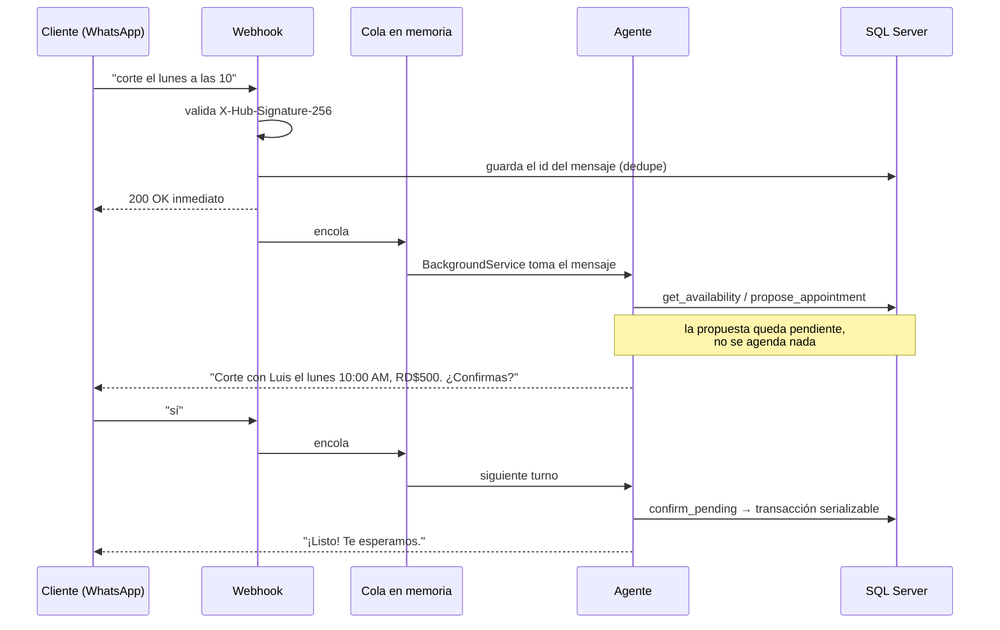

# AgendaBot

Backend en ASP.NET Core para que una barbería atienda su WhatsApp con un agente de IA: el cliente
escribe "¿tienes algo mañana después de las 4 para un corte?", el agente busca horarios libres,
propone uno, espera el "sí" y agenda. Un día antes le manda un recordatorio.

En RD muchos negocios pequeños agendan así, a mano, contestando mensajes todo el día. El objetivo
de este proyecto es resolver esa parte sin que el dueño pierda el control de su agenda.

**Stack:** .NET 10 · ASP.NET Core minimal APIs · EF Core 10 · SQL Server · Microsoft.Extensions.AI ·
Claude Haiku 4.5 · WhatsApp Cloud API · xUnit + Testcontainers · GitHub Actions · Docker

## Cómo funciona



## Decisiones que vale la pena explicar

**El modelo no puede agendar solo.** Las herramientas de escritura (`propose_appointment`,
`propose_cancel`) no tocan la agenda: dejan una propuesta pendiente en la conversación.
`confirm_pending` la ejecuta solo si el cliente escribió algo *después* de la propuesta. Si el
modelo intenta proponer y confirmar en el mismo turno (porque el cliente escribió "agéndame sin
preguntar" o por un error suyo), el servidor lo rechaza. La regla está en C#, no en el prompt, y
tiene su test: si se quita, el test falla.

**Doble reserva.** El chequeo de solapamiento y el insert van en una transacción `Serializable`.
SQL Server bloquea el rango `(StaffId, Start)` y, si dos personas piden el mismo horario a la vez,
deja pasar a una y a la otra la elige como víctima de deadlock, que se traduce en "ese horario ya
está ocupado". El test lanza 8 reservas iguales en paralelo contra SQL Server real: con
`ReadCommitted` entraban las 8; con `Serializable` entra una.

**Tests contra SQL Server real, no InMemory.** El proveedor InMemory no tiene transacciones ni
bloqueos, así que el test de concurrencia no probaría nada. En CI, Testcontainers levanta SQL
Server; en local se puede apuntar a uno instalado con `AGENDABOT_TEST_SQL`.

**Dos proyectos, sin capas de más.** `AgendaBot.Api` está organizado por feature (`Scheduling/`,
`Agent/`, `WhatsApp/`, `Admin/`) y usa el `DbContext` directamente. EF Core ya es unit of work y
repositorio; envolverlo en otro repositorio genérico no agregaba nada acá.

**El agente no depende del proveedor.** Usa `IChatClient` de `Microsoft.Extensions.AI`. En
producción es Claude Haiku 4.5 (rápido y barato para este flujo); en los tests es un modelo falso
que devuelve tool calls guionadas.

**Costo del LLM con tope.** Hay un límite de mensajes por número en el webhook y por IP en la demo,
un tope diario global para la demo, un máximo de 6 llamadas a herramientas por mensaje y una
ventana de historial de 20 mensajes.

**Webhook que responde rápido.** Meta reintenta si no recibe 200 a tiempo, así que el webhook
valida la firma, deduplica por id de mensaje y encola; un `BackgroundService` hace el trabajo
lento. La cola es en memoria (`Channel<T>`): si la API se cae con mensajes encolados, se pierden.
Para el volumen de una barbería alcanza; el paso siguiente sería una cola persistente.

## Demo

`/` sirve un chat que habla con el mismo agente sin pasar por WhatsApp. Al lado, un "ticket"
imprime qué herramientas usó el agente en cada turno y qué respondió el servidor, incluidos los
rechazos.

## Correrlo en local

Hace falta el SDK de .NET 10 y Docker (o un SQL Server local).

```bash
docker compose up -d                       # SQL Server en el puerto 1434
dotnet run --project src/AgendaBot.Api     # migra y siembra una barbería de ejemplo
```

En desarrollo, el login del panel es `admin-dev` (ver `appsettings.Development.json`). Para que
el agente responda, define la API key:

```bash
dotnet user-secrets --project src/AgendaBot.Api set "Anthropic:ApiKey" "sk-ant-..."
```

### Tests

```bash
dotnet test                                # levanta SQL Server con Testcontainers
dotnet test --filter "Category=Eval"       # evals contra el modelo real (necesita ANTHROPIC_API_KEY)
```

Las evals son 13 conversaciones guionadas (fechas relativas, horario ocupado, domingo cerrado,
cambio de hora, "déjame pensarlo", intento de saltarse la confirmación…). Se califican por lo que
quedó en la base, no por el texto, que varía entre corridas.

Para crear migraciones: `ASPNETCORE_ENVIRONMENT=Development dotnet ef migrations add <Nombre> -p src/AgendaBot.Api -o Data/Migrations`.

## Configuración en producción

| Clave | Para qué |
| --- | --- |
| `ConnectionStrings:Default` | SQL Server |
| `Auth:AdminPassword`, `Auth:JwtKey` (≥ 32 caracteres) | Login del panel |
| `Anthropic:ApiKey` | El agente. Sin ella, el resto funciona y el agente responde que no está configurado |
| `WhatsApp:VerifyToken`, `WhatsApp:AppSecret`, `WhatsApp:AccessToken`, `WhatsApp:PhoneNumberId` | App de Meta |
| `Reminders:Enabled`, `Reminders:Template` | Recordatorios (plantilla aprobada en Meta) |
| `Business:Name` | Nombre que usa el agente |
| `Seed:Demo` | Sembrar la barbería de ejemplo |

## Fuera de alcance por ahora

Pagos, varios negocios en la misma instancia, audios e imágenes, y una app para el dueño.
