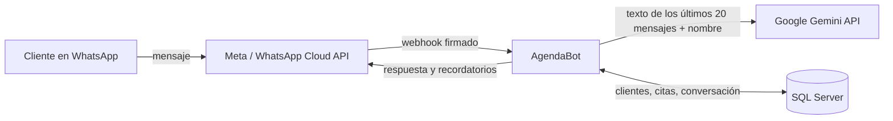

# Privacidad y datos

AgendaBot lo instala un negocio (la barbería) para atender su WhatsApp. El negocio es el
**responsable** de los datos de sus clientes; quien hospeda AgendaBot, y los servicios de abajo,
son **encargados** que los procesan por cuenta del negocio. Este documento explica qué datos toca
el sistema, a quién se los pasa y qué tiene que hacer el negocio antes de ponerlo en producción.
Al final hay un aviso de privacidad listo para adaptar y publicar.

No es asesoría legal: es lo que el código hace hoy, escrito para que el negocio (y su abogado)
puedan revisarlo.

## Qué se guarda

| Dato | De dónde sale | Para qué | Cuánto tiempo |
| --- | --- | --- | --- |
| Número de WhatsApp | Lo manda Meta con cada mensaje | Identificar al cliente, responderle, mandarle el recordatorio | Mientras sea cliente, o hasta que pida borrarlo |
| Nombre | Lo dice el cliente en el chat (o lo escribe el dueño en el panel) | Agendar la cita a su nombre | Igual que el número |
| Citas (servicio, barbero, fecha, estado) | Las crea el agente o el dueño | Llevar la agenda | Igual que el número; si pide borrar, las pasadas quedan sin nombre ni número |
| Texto de la conversación | Lo que escribe el cliente y lo que responde el agente | Darle contexto al agente (usa los últimos 20 mensajes) | **90 días** (`Retention:ConversationDays`), después se borra solo |
| Aceptación y baja de recordatorios | Al confirmar una cita por el chat, con ALTA/BAJA o desde el panel | Cumplir la política de WhatsApp | Igual que el número |
| Id técnico de cada mensaje de WhatsApp | Meta | Descartar los reintentos del webhook | 7 días (`Retention:ProcessedMessageDays`) |

No se guardan audios, imágenes ni ubicaciones (el bot responde que solo lee texto), ni datos de
pago. El nombre que el cliente tiene en su perfil de WhatsApp llega en el webhook pero no se usa.
Los logs no tienen el texto de los mensajes y los números aparecen enmascarados (`…1234`).

## A quién se le pasan

| Encargado | Qué recibe | Dónde |
| --- | --- | --- |
| Meta Platforms (WhatsApp Business / Cloud API) | Número, mensajes en ambas direcciones | EE. UU. y otros países |
| Google (Gemini API) | Texto de la conversación y el nombre del cliente, **no** el número | EE. UU. y otros países |
| Anthropic (Claude), solo si se configura en vez de Gemini | Lo mismo que Gemini | EE. UU. |
| Hosting de la API y la base (el plan es Azure App Service + Azure SQL) | Todo lo de la tabla de arriba | La región que se elija al crear los recursos |

Todos están fuera de República Dominicana, así que hay transferencia internacional de datos.

Un detalle importante sobre Gemini: con una API key del **plan gratis**, Google puede usar lo que
se le manda para mejorar sus productos y puede haber revisión humana. Con un negocio real hay que
usar el plan de pago (facturación activada en Google Cloud), donde Google no usa los datos para
entrenar. La demo pública usa el plan gratis, por eso pide no escribir datos reales.

## Lo que el código ya hace

- **Aviso de IA en el primer mensaje.** La primera respuesta de cada conversación dice que es un
  asistente automático de qué negocio, que puede equivocarse, dónde hablar con una persona
  (`Business:Contact`), cómo darse de baja y cómo borrar los datos, con el
  enlace del aviso de privacidad si `Business:PrivacyUrl` está configurado. Está en
  `AgentService`, no en el prompt, así que no depende de que el modelo lo diga.
- **Recordatorios solo con opt-in** (política de WhatsApp Business). Se marca cuando el cliente
  confirma una cita por el chat (ya le avisamos en el primer mensaje que se le recuerda un día
  antes), cuando escribe ALTA, o cuando el dueño agenda desde el panel con
  `"remindersOptIn": true` porque el cliente le dijo que sí. Fuera de la ventana de 24 h solo se
  usa la plantilla aprobada en Meta (`Reminders:Template`).
- **BAJA / STOP** apaga los recordatorios. El bot sigue respondiendo si el cliente escribe, pero
  no le escribe por iniciativa propia. **ALTA / START** los vuelve a activar.
- **BORRAR MIS DATOS** borra la conversación, cancela las citas futuras y deja al cliente sin
  nombre ni número. Las citas pasadas quedan anónimas para que la agenda no tenga huecos.
- Estas tres palabras clave se resuelven en el servidor: no pasan por el modelo ni se guardan.
- **Panel:** `GET /admin/customers/{telefono}` devuelve todo lo guardado de un número (derecho de
  acceso) y `DELETE /admin/customers/{telefono}` hace lo mismo que BORRAR MIS DATOS, para pedidos
  que llegan por correo o en persona.
- **Limpieza automática** cada 6 horas de mensajes con más de 90 días (`Retention`).

## Lo que tiene que hacer el negocio

1. Publicar el aviso de abajo (en su web, Instagram o un enlace corto) y poner la URL en
   `Business:PrivacyUrl`. Poner en `Business:Name` el nombre con el que el cliente conoce al
   negocio y en `Business:Contact` un teléfono o correo donde responda una persona: el primer
   mensaje los muestra para que se sepa quién está detrás del bot.
2. Usar Gemini con facturación activada, no la key gratis.
3. Crear la plantilla del recordatorio en Meta incluyendo la salida, por ejemplo: "Hola {{1}}, te
   recordamos tu cita de {{2}} {{3}}. Si no puedes venir, respóndenos y la cancelamos. Escribe
   BAJA para no recibir más recordatorios."
4. Si agenda clientes desde el panel, marcar `remindersOptIn` solo cuando el cliente aceptó.
5. Atender los pedidos de acceso, corrección o borrado que lleguen por otros medios (con los
   endpoints del panel) y responderlos sin demora.
6. Si hay una filtración: avisar a los clientes afectados y, si tiene clientes en la UE, a la
   autoridad dentro de 72 horas.
7. Que un abogado revise el aviso antes de usarlo con clientes reales.

## Aviso de privacidad (plantilla)

> Reemplaza lo que está entre corchetes.

**Aviso de privacidad de [Nombre del negocio]**

Última actualización: [fecha]

[Nombre comercial] ([razón social], RNC [número], si factura), con domicilio en [dirección,
ciudad] y contacto en [correo o teléfono], es responsable de los datos que nos das cuando nos
escribes por WhatsApp.

**Quién te responde.** Nuestro WhatsApp lo atiende un asistente automático con inteligencia
artificial. Puede equivocarse; si algo no te cuadra, escríbenos y lo revisa una persona.

**Qué datos usamos y para qué.** Tu número de WhatsApp, tu nombre, tus citas y lo que nos
escribes, para responderte, agendar o cancelar citas y recordártelas un día antes. Lo hacemos
porque lo pides tú (para darte el servicio) y, en el caso de los recordatorios, porque lo
aceptas al confirmar la cita. No usamos tus datos para publicidad.

**Con quién los compartimos.** Solo con los proveedores que hacen funcionar el servicio: Meta
(WhatsApp), Google (Gemini, el modelo de IA que redacta las respuestas; recibe el texto de la
conversación y tu nombre, no tu número) y [proveedor de hosting]. Están fuera de República
Dominicana, así que tus datos se transfieren a otros países, con las garantías que esos
proveedores ofrecen en sus contratos.

**Cuánto tiempo.** Los mensajes se borran a los 90 días. Tu nombre, número y citas los
guardamos mientras seas cliente o hasta que nos pidas borrarlos.

**Tus derechos.** Puedes pedir ver, corregir o borrar tus datos, y oponerte a recibir
recordatorios:

- Escribe **BAJA** para dejar de recibir recordatorios (**ALTA** para volver a recibirlos).
- Escribe **BORRAR MIS DATOS** para borrar tu nombre, tu número y la conversación. Si tenías
  citas pendientes, se cancelan.
- Para cualquier otra cosa, escríbenos a [correo].

Si crees que no tratamos bien tus datos, puedes reclamar ante [en RD: la autoridad que aplique
según la Ley 172-13; en la UE: la autoridad de protección de datos de tu país].

**Menores.** El servicio no está pensado para menores de 16 años sin un adulto responsable.

**Cambios.** Si cambiamos este aviso, lo publicamos en este mismo enlace con la fecha nueva.
